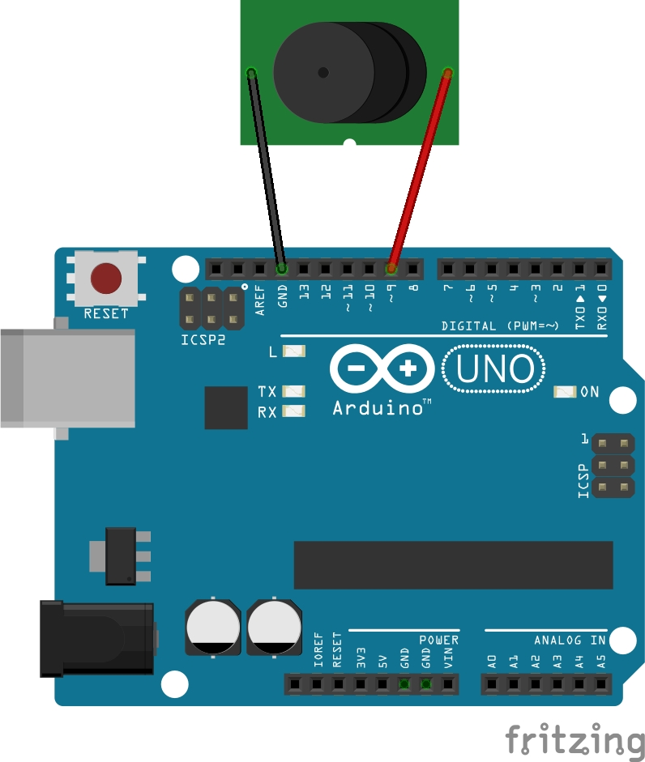

# Arduino Music Maker

A TUI (Text User Interface) F# program for composing and playing melodies on an Arduino connected via serial communication.


## Prerequisites

Before using this application, ensure you have the following:

*   **[.NET SDK 8 or later](https://dotnet.microsoft.com/download):**  Required if you intend to build the project from source. Precompiled binaries are also available (see "Quick Start" below).
*   **An Arduino board:**  Equipped with a buzzer connected to a PWM-capable pin. The default pin is 9, but this is configurable in `receiver/config.h`.
*   **The Arduino code:** Located in the `receiver` folder, must be uploaded to your Arduino board.
*   **A serial connection:**  A working serial connection between your computer and the Arduino is necessary for communication.

## Arduino Setup



1.  **Connect the Buzzer:**  Wire the buzzer to the Arduino as shown in the schematic above.
2.  **Open the Arduino IDE.**
3.  **Open `receiver/receiver.ino`:**  Open this file within the Arduino IDE.
4.  **Select the correct board:** Choose your specific Arduino board from the IDE's Tools menu.
5.  **Select the correct serial port:** Choose the serial port connected to your Arduino.
6.  **Upload the sketch:** Upload the code to your Arduino board.

**Important Notes:**

*   Ensure the buzzer is connected to the PWM pin defined by `BUZZER_PIN` in `receiver/config.h` (defaults to pin 9).
*   Verify that the `BAUD_RATE` in `receiver/config.h` matches the baud rate used by the F# application (default is 9600).

## Installation

### Quick Start

**Ensure that you have completed the prerequisites and the Arduino setup before proceeding.**

#### Windows

1.  **Download:** Get the `.exe` file from the [releases page](https://github.com/araujoviana/arduino-music-maker/releases/).
2.  **Run:** Execute the downloaded file.

#### Linux

1.  **Download:** Download the `.tar.xz` file from the [releases page](https://github.com/araujoviana/arduino-music-maker/releases/).
2.  **Extract:**  Use the following command to extract the archive:
    ```bash
    tar -xvf arduino-music-maker-linux64.tar.xz
    ```
3.  **Grant Execute Permissions:** Give the binary execution permissions:
    ```bash
    chmod +x arduino-music-maker
    ```
4.  **Run:** Execute the file from your terminal:
    ```bash
    ./arduino-music-maker
    ```

### Development

1.  **Clone the Repository:**
    ```bash
    git clone https://github.com/araujoviana/arduino-music-maker
    ```
2.  **Navigate to the Project:**
    ```bash
    cd arduino-music-maker
    ```
3.  **Build the Project:**
    ```bash
    dotnet build
    ```
4.  **Run the Application:**
    ```bash
    dotnet run
    ```

## Usage

Run the application and follow the on-screen instructions. Be sure that the baud rate and serial port configured in the application match the Arduino settings (The baud rate is defined in `receiver/config.h`).
